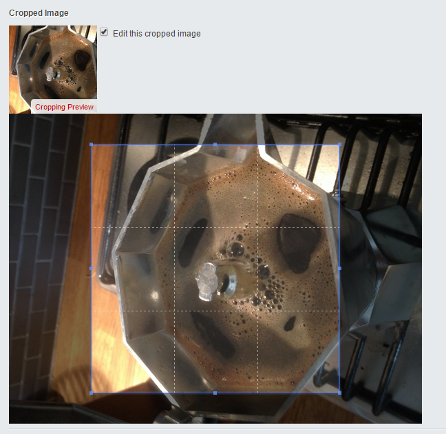

SilverStripe CropperField
===

[](http://travis-ci.org/willmorgan/silverstripe-cropperfield)

Do you need to crop your images for art direction purposes?

Perhaps this is for responsive design, or perhaps you're tired of `CroppedResize`, `PaddedResize`, `Square` and general centre-based resizing functionality in SilverStripe that doesn't quite meet your image cropping needs.

Maybe `CropperField` is for you. Whilst it's called `CropperField`, that's just the user interface. Behind the scenes, a clean and extensible architecture allows you to crop almost anything - external URLs, documents, video frames, etc..

For the field itself, the frontend is powered by [Cropper v0.7.5](https://github.com/fengyuanchen/cropper) by Fengyuan Chen.

**Warning: Under development / alpha. Do not use unless you are prepared to contribute!**

### Installation

0. `composer require willmorgan/silverstripe-cropperfield`
1. Specify a version constraint.
  * While this module is in heavy development, you probably want to use `~0.X` or similar.

### Screenshot

The field currently looks like this in a CMS setting.



### Usage

0. Specify a `$has_one` `Image` relationship on the object that should own the cropped image.
1. Specify an image based `UploadField` whose image you wish to crop.
  * Only `UploadField` is supported right now. Non-images will break. Sorry.
2. Create an `AdapterInterface` implementor to pass into your `CropperField`
  * See [1]; the adapters are generic enough for you to supply anything - as long as there's a `File`
object backing it (regardless of whether it exists).
3. Set some options, if you so desire.
4. Happy cropping.

#### Example

In this example, a configuration like this has been set up:

```php
$has_one = array(
	'MyBigPhoto' => 'Image',
	'MyArtDirectionCrop' => 'Image',
);
```

Inside a `getCMSFields` call, or similar:

```php
$uploadField = new UploadField('MyBigPhoto', 'Big Photo Uploader');
$cropperField = new CropperField\CropperField(
	'MyArtDirectionCrop',
	'Cropped Image',
	new CropperField\Adapter\UploadField(
		$uploadField
	)
);
```

You can now use `$MyArtDirectionCrop` in your template as you would any other image (i.e. you can use `$ResizeRatio`, `$Square`, etc.)

The initial benefit is the CMS user gets to specify the true focus point of a potentially high resolution image, and you / your frontend team can reuse that base cropped image responsively, be it using `srcset`, `picture + source`, etc.

#### Options

You can set these options on the CropperField to get some control over your CMS users' actions.

Option name|Value example|Default value|Description
-----------|-------------|-------------|-----------
`aspect_ratio`|`null` or positive float, like `16/9`|`null`|The aspect ratio you want generated cropped images to have.
`crop_min_width`|Positive integer, like `256`|`256`|The minimum dimensions a crop can be, in px.
`crop_min_height`|Positive integer, like `256`|`256`
`crop_max_width`|`null` or positive integer|`null`|Maximum dimensions a crop can be, in px.<br>Blank by default because this restricts the art direction somewhat. If you wish to limit the actual generated size of the cropped image, set `generated_max_*` instead.
`crop_max_height`|`null` or positive integer|`null`
`generated_max_width`|Positive integer, like `512`|`512`|The maximum dimensions a generated image can be, in px.<br>If the crop is above this, then it will be downscaled according to the declared aspect ratio, or the implied aspect ratio if one is not specified.
`generated_max_height`|Positive integer, like `512`|`512`

#### Supplied Adapters

* `CropperField\Adapter\UploadField` for image based upload fields

#### Supplied Croppers

* `CropperField\Cropper\GD` for GD installations
* Imagick coming soon

#### Customisation

* Templates: you can easily customise the template used - just override `CropperField.ss`
* You can write your own croppers (say, for `Imagick`).
  1. Implement the `CropperInterface`
  2. Either set it on a per-instance basis using `CropperField->setCropper()`
  3. Set it in YML, overriding `CropperFactory.cropper`. The factory uses `Injector` for DI.

### Compatibility

* While Cropper is able to support browsers as old as IE8, the `CropperField` CMS UI has been tested only in Chrome.

### Similar modules

If this doesn't look right for you*, check out some alternatives:

* [@jonom has built silverstripe-focuspoint](https://github.com/jonom/silverstripe-focuspoint), which is powered by his popular [jQuery FocusPoint library](https://github.com/jonom/jquery-focuspoint)

_* As a sidenote, I'd appreciate you taking the time to let me know why_

### Licensing
* SilverStripe CropperField is released under the BSD License; however, please note:
* [Cropper v0.7.5](https://github.com/fengyuanchen/cropper) is released under the MIT license.

### Built by

[Will Morgan](http://willmorgan.co.uk), who is available for hire.
